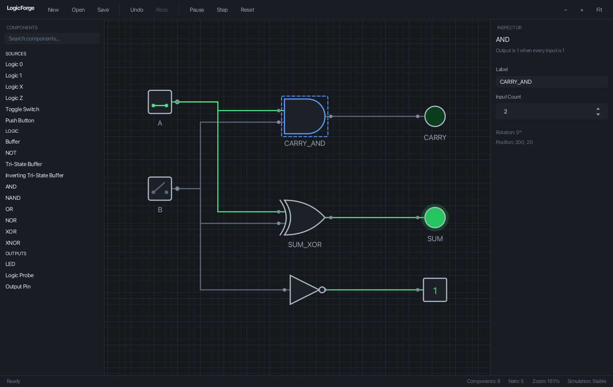

# LogicForge

LogicForge is a modern cross-platform digital logic simulator written in Java. It combines
an extensible circuit model, a deterministic simulation core, an interactive graphical
editor and a programmable educational 8-bit computer. Circuits use four-state digital
signals and can be simulated as fast behavioral blocks or descended through reusable
structural implementations built from ordinary gates and subcircuits.



## Current scope

**Signals.** Every signal is four-state — `0`, `1`, `X` (unknown) and `Z` (not driven) — and
the rules for combining them live in exactly one place. An unconnected gate input reads as
`X`, never as an implicit `0`. Nets support any number of drivers, so tri-state buffers and
driver conflicts behave the way they do in hardware.

**Components.**

| Category | Components |
| --- | --- |
| Sources | Logic 0, Logic 1, Logic X, Logic Z, Toggle Switch, Push Button, Clock |
| Logic | Buffer, NOT, Tri-State Buffer, Inverting Tri-State Buffer, AND, NAND, OR, NOR, XOR, XNOR |
| Sequential | Latches, flip-flops, registers, shift registers, counters |
| Routing | MUX/DEMUX, encoders/decoders, splitter/joiner, bus constants/probes and wide tri-state buffers |
| Arithmetic | Half/full adders, adder/subtractor, ALU, comparator, shifts, parity and increment/decrement |
| Memory | Register File, RAM, ROM |
| System | Width-configurable input/output ports and a memory-mapped 16-bit timer |
| Outputs | LED, Logic Probe, Output Pin, Bus Probe |

The six multi-input gates take 2 to 16 inputs, configurable per instance in the inspector.

**Physical chips.** Real 7400-series parts (74HC00, 74HC08, 74HC86, 74HC283 and more) place
and wire as physical DIP packages, not just behavioral stand-ins: pins have real numbers and
positions, ground/power pins are present but not connectable, and a `ChipInstanceExpander`
expands each package into its logical gates before the ordinary compiler ever runs, so
placing a chip never changes what the simulator itself understands. `ElectricalEndpoint`
(a component port or a physical chip pin) is the one type the editor, the router, the hit
tester and the renderer all speak, so a wire between two chip pins, or a chip pin and a port,
is handled exactly like any other wire — including logic analyzer watches and cross-probing.
A package can be shown as its full body or as a compact logic symbol without moving a single
pin. Ground/power pins are rendered and hit-tested but refuse a wire.

**Editor and hierarchy.** Drag components or chips out of a searchable palette, wire ports
together with orthogonal wires that follow when components move or rotate, select with
clicks or a rubber band, move, rotate, copy, paste, delete, undo and redo everything (a
mixed component-and-chip drag or rotate is still one undo step), zoom around the cursor, pan,
expand bus ports into individual bit pins, and watch signals — including a chip's physical
pins — in the docked logic analyzer while the circuit runs. Subcircuits can be opened and
edited in context. RAM and ROM contents are inspectable and support raw binary load/save.

**Logic analyzer.** Beyond live waveforms, a compact trigger arms on any watched signal —
rising/falling/any edge, or a bus reaching (or leaving) an exact value, four-valued-aware
throughout (a transition through `X` or `Z` is never mistaken for a literal edge) — and
pauses the shared run control the moment it fires, the same control the toolbar and Study
window drive. Several delta-cycle transitions landing at the same physical instant (a
same-cycle glitch) are drawn as a small visible ladder rather than overdrawing one pixel
column, so a transient the recorder captured is a transient you can actually see.

**LF-8 computer.** The hierarchical LF-8 executes real machine code with eight registers,
flags, stack operations, branches, `CALL`/`RET`, `EI`/`DI`, IRQ, NMI and `IRET`. IRQ, NMI and
startup addresses are little-endian vectors read from external ROM through the normal bus.
Interrupt entry saves a status byte containing Z/C/N/V and interrupt-enable state, and
`IRET` restores it. The centralized memory map provides ROM, RAM, MMIO and vector regions;
the included input port, output port and timer are wired as ordinary memory-mapped devices,
and the timer can raise a real CPU interrupt. A separate `lf8-tools` module supplies the
assembler and disassembler.

**Structural implementations.** The headless `component-structures` module supplies a
registry of canonical reference circuits: gate-level 2:1 muxes (widths 1, 3, 4, 8 and 16),
half/full/ripple adders, a 16-bit decrementer, SR and D latches, a master-slave DFF,
Register8, an 8x8 dual-read register file and ALU8. These are real hierarchies, not
behavioral components hidden inside subcircuits, and every one registered is proven
equivalent to its behavioral counterpart — including four-valued `X`/`Z` propagation, not
just fully-defined values — by a dedicated test that drives both from the same source and
compares their outputs directly. (A gate-level 2-to-4 decoder exists in the same module but
is deliberately *not* registered: it lacks the behavioral decoder's `ENABLE` input, and its
product-term structure resolves some outputs to a definite `0` on a partially undefined
select where the behavioral component conservatively drives every output to `X` — a genuine
divergence, not just a port-shape mismatch. See `StructuralDecoderTest` for the exact case.)
LF-8 `STRUCTURAL` mode replaces its ALU and register file with these circuits, exposing both
deep paths in a running processor, and `GATE_LEVEL` mode goes further still. All three
modes are differentially tested instruction-by-instruction against `FAST` — the reference —
across arithmetic, logic, shifts, flag boundary values (`0x00`/`0x01`/`0x7F`/`0x80`/`0xFE`/
`0xFF`) and interrupt handling (`IRQ`, `NMI` and `IRET`), so a mode swap is proven to change
only *how* the processor computes a result, never *what* it computes:

```text
CPU -> Datapath -> ALU -> RippleAdder8 -> FullAdder -> HalfAdder -> gates
CPU -> Datapath -> RegisterFile -> Register8 -> DFF -> D Latch -> SR Latch -> gates
```

**Study window.** The workbench's Study action opens a read-only view in a separate window.
It can attach to the exact live simulation, descend through concrete component instances,
navigate backward and forward, and show current `0`/`1`/`X`/`Z` port values and debug state.
LF-8 inspection includes registers, PC, SP, IR, flags, IE, interrupt state, the current
instruction, the raw microcode word, decoded ALU operation and active control signals.
Controls pause/run the shared simulation and step one event, clock edge or instruction
boundary without mutating CPU state directly.

**Projects.** Circuits are saved as versioned JSON (`.logic`). Loading a saved project
restores the same circuit structurally, wire for wire.

### Current limits

`FAST` remains the default LF-8 implementation. `STRUCTURAL` decomposes the ALU and
register file; `GATE_LEVEL` goes further, also replacing the PC, stack pointer, general
registers and the microstep counter with the same structural register/counter/mux
hierarchies, down to individual gates. The instruction control unit's own microcode
sequencing is not itself decomposed into gates in any mode. Real 7400-series parts place
and wire as physical packages (see **Physical chips** above), but transistor networks and
physical propagation timing are still future layers — a placed 74HC00 simulates as four
ideal NAND gates, not as a transistor-level model of the actual part. LogicForge does not
claim to be a cycle-accurate 6502 or a transistor-level CPU simulator.

## Architecture

The simulation core has no dependency on JavaFX, and never will. Circuits can be built,
compiled and simulated headlessly:

```
UI  →  Circuit Document  →  Circuit Compiler  →  Simulation Core  →  Signal State
```

| Module | Contents |
| --- | --- |
| `logic-core` | Four-state logic, `LogicVector`, the central logic semantics |
| `circuit-model` | The document the user edits: components, wires, geometry, parameters |
| `simulation-core` | Nets, the delta-cycle event engine, compiled runtime structures |
| `logic-analyzer` | Headless sampling, trace data, waveform segments and the trigger engine |
| `component-library` | Component definitions, behaviours and the registry |
| `component-structures` | Canonical gate-level and hierarchical reference circuits |
| `circuit-compiler` | Validation, net forming, compact runtime ids, source mapping |
| `project-format` | Versioned JSON persistence |
| `processor-lf8` | LF-8 CPU, microcode, memory map and computer circuit factory |
| `processor-lf8-runtime` | Headless runtime probing (registers, flags, microstep) for tests and tools |
| `lf8-tools` | LF-8 assembler and disassembler |
| `ui` | Viewport, wire router, commands, renderers and the JavaFX views |
| `app` | The application entry point and development tools |

`docs/architecture.md` describes the design and the decisions behind it in detail.

## Build and run

LogicForge needs a JDK 25. Everything else — Gradle and JavaFX — is fetched by the wrapper.

```bash
./gradlew :app:run          # start the application
./gradlew test              # run the whole test suite (headless, no JavaFX needed)
```

The JavaFX dependencies are resolved for the platform you build on, so build on the
platform you want to run on. The code itself contains nothing platform-specific.

Development helpers:

```bash
./gradlew :app:screenshot   # render the workbench into app/build/screenshot.png
./gradlew :app:uiCheck      # replay editor gestures against the real UI
./gradlew :app:examples     # regenerate examples/ through the real save path
```

## Controls

| Action | Gesture |
| --- | --- |
| Place a component | Drag it from the palette, or double-click it and click on the canvas |
| Draw a wire | Drag from one port to another |
| Toggle an input | Click a switch or a button |
| Select | Click; Shift-click or ⌘/Ctrl-click to add; drag on empty canvas for a rubber band |
| Move | Drag the selection |
| Rotate | `R` |
| Delete | `Delete` or `Backspace` |
| Cancel the current gesture | `Escape` |
| Zoom | Mouse wheel, trackpad scroll or pinch — always around the cursor |
| Pan | Middle-drag, or Alt-drag |
| New / Open / Save / Save As | ⌘/Ctrl `N` `O` `S`, ⇧⌘/Ctrl-Shift `S` |
| Undo / Redo | ⌘/Ctrl `Z`, ⇧⌘/Ctrl-Shift `Z` (or Ctrl `Y`) |
| Copy / Paste / Duplicate | ⌘/Ctrl `C` `V` `D` |
| Search the palette | ⌘/Ctrl `F` |
| Zoom in / out / reset | ⌘/Ctrl `+` `-` `0` |
| Open live Study view | Click **Study** in the toolbar |

## Examples

`examples/` contains circuits generated by the application itself, `./gradlew :app:examples`
regenerates them through the real save path, and `verifyExamples` guards against drift:

- Top level — `NOT.logic`, `AND.logic`/`XOR.logic`, `Half-Adder.logic`,
  `Tri-State-Bus.logic` (two tri-state drivers sharing one net: `Z` when idle, `X` when they
  disagree)
- `logic/` — gates, mux, decoder, SR latch, D latch, DFF
- `arithmetic/` — half/full/ripple adder, ALU8
- `memory/` — Register8, an 8x8 register file, RAM, ROM
- `physical-ic/` — a switch and LED wired directly to real 74HC00 physical pins, a
  half adder built from a 74HC86 and a 74HC08, and a 4-bit adder built from a real 74HC283
- `lf8/` — the same LF-8 computer under `FAST`, `STRUCTURAL` and `GATE_LEVEL`

## Project status and next layers

The simulator, editor, hierarchy compiler, physical chip pipeline, programmable LF-8
(including `GATE_LEVEL`), vector interrupts, MMIO, timer, structural library, logic analyzer
trigger and Study workflow are implemented and covered by headless tests, JavaFX interaction
checks and (for LF-8) instruction-level differential tests across all three implementation
modes. A headless breakpoint engine (PC, memory read, memory write) exists but is not yet
wired into the Study window's UI. Reusable component metadata and truth tables, analyzer
performance at very long captures, and richer physical package models (more 7400-series
parts, memory ICs) are the next intended layers.

## License

MIT — see `LICENSE`.
